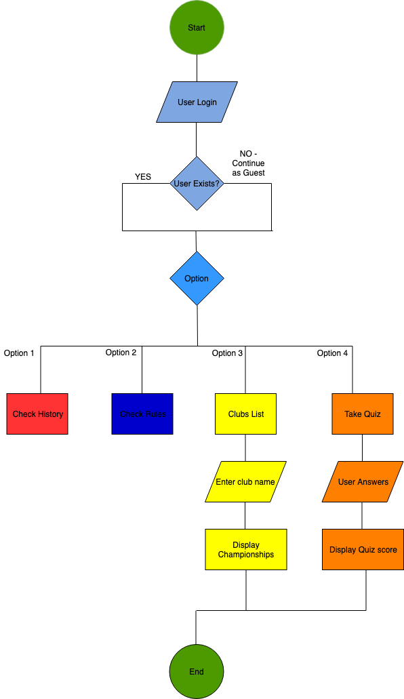

# HELP

## Before using the Application

Github repository for the project
https://github.com/pankajpawar2/Footy-Terminal-App

1. Please make sure you have ruby installed on your machine. Clone the repository. Type in below command 

```txt
git clone https://github.com/pankajpawar2/Footy-Terminal-App.git
```

2. 'cd' into the repository you have cloned

3. Run the build shell script. Type below command in terminal
```
 bash build.sh
```
3. 'cd' into the dist directory.

4. To run the application, type below command
```
 ruby footypedia.rb
```
5. The application can also be run in advanced mode
```
   ruby footypedia.rb "history" - To go to History page directly

   ruby footypedia.rb "rules" - To go to Rules page directly
```

# Software Development Plan

Software development plan states the purpose of the terminal application, providing a list of functions/features that will be implemented in the application.

## Contents

*  Statement of Purpose
*  Included Features
*  User Interaction Guide
*  Error Handling
*  Control Flow Diagram
*  Feature Implementation Plan
*  Test Cases
*  Project Development 
*  Help

## Statement of Purpose

The Terminal applications is called "FOOTYHUB". The users of the application will be able to understand the history of Australian Football League(AFL) and understand the rules and common terms used in the game. Australian Football League is common sports played across australia, with Victoria being the dominant state. It has around 8 teams participating each year from total of 18.

The reason for developing this terminal application is to provide users with simple application to get all the information regarding Australian Footbal League.

Users will be presented with a login screen when the application starts. Once user is verified, the user is presented with home page with different menu options.
Users can choose any option and depending on the selection, will be directed to the corresponding page.
Some of the data is stored in CSV/Text files and it is being retrieved depending on the user input.

Users will be able to check the list of active clubs and depending on the chosen team, can see how many championships they have won till date. Users can also take a quiz which will help them to test their footy knowledge.

This application is mainly intended for users to understand the game of Footy and anyone who likes the game can benefit from this application. The main aim of the application is to keep it simple and make it user friendly, so that anyone can use the application without any difficulties.

## Included Features

The application has various features, which are listed below:

* ***User Login***

This is the first feature of the application and provides users access to use the application.


The login page checks if the username and password is correct. This is done by reading the "Users.csv" file and checking if the username and password is correct.
*user_verification* is the function used to perform user verification. This function takes two arguments - username and password. The function then checks the csv file to complete user verification.
If the user does not exist, there is an option to continue as guest.

Control flow structure redirects users to appropriate sections of the application.
Error handling functionality has been implemented for this feature. When user enters a blank username, it raises an exception that "Username can not be blank". 


* ***Check History of Foooty***

Once the user has successfully logged in, they can choose from several options which are displayed on a menu.
The first option will help users to know a brief history of the game.


*check_history* is the the function used for this purpose.
When the history option is selected, the function reads data from 'history.txt' file and displays it to the user.


* ***Rules of Foooty***

The second option is 'Rules' which will help users to know some of the rules of the game.


*check_rules* is the the function used for this purpose.
When the 'Rules' option is selected, the function reads data from 'rules.txt' file and displays it to the user.


* ***List of Clubs***

The third option is 'Clubs List' which will display a list of active clubs in footy.


*display_team_list* is the the function used for this purpose.
When the 'Clubs List' option is selected, the function reads data from teams_array, sorts the array alphabetically and displays it to the user.

The function also accepts user input to get users favourite team. Depending on the input(Team), the app displays the championships won by the team. It also represents the data in a pie chart to the user.
This is achieved by reading data from 'championships.csv' file. teams_championships is the function used to achieve this, which takes team_array as an argument.


* ***Take the Quiz***

The fourth option is 'Take the Quiz' which will ask the users to take a quiz to test their footy knowledge.
Users will be presented with five questions and will be provided with final score at the end of the quiz.


*take_quiz* is the the function used for this purpose.


## User Interaction Guide

This section will provide a brief summary for users to know how to use and interact with different features of the application.
(Different commands which can be used to start and interact with this terminal application are listed in the Help section)

### Login Section:
Users will have to input their username and password using keyboard. While the user is typing the password, the password will not be displayed on the screen. It is therefore important, that user enters correct password.
This is for security purposes so that no one else can see users password.


### Choose menu options (After user has logged in):
To choose a particular option from the menu, use the arrow keys(Up and Down) on the keyboard to navigate to the option.
Then press either ENTER or SPACE to select the option.


### Enter favourite team(Clubs List option):
User will need to use keyboard to enter in their favourite team.


### Answering quiz questions(Take the Quiz option):
When taking the quiz, users will have to enter numbers between 1 to 4 using keyboard to submit their answers. As there are only 4 answer options, users need to enter a valid answer which can be any number between 1 and 4.

### Exiting the application
To close the application, navigate to the Exit option using UP/DOWN arrow keys on the keyboard and press ENTER.


## Flowchart




## Feature Implementation Plan

This section provides information regarding how each feature has been implemented and a checklist for each feature.

* Login for the Application

User is prompted to enter a username and password. Following block of code is used to get user input.

```
begin
    puts font.write('FOOTYHUB', letter_spacing: 1).blink
    puts "Login to continue\nEnter your username"
    input = gets.chomp
    raise if input == '' || input[0] == Integer

    puts 'Enter your password'
    password = STDIN.noecho(&:gets).chomp
    user_verification(input, password)
    break
  rescue StandardError
    puts 'Oopsss. Something happened. Username cannot be blank'
end
```
After user enter the username and password, a function 'user_verification' is called to verify if the user exists in the database. A list of users is stored in a csv file called "Users.csv"

Function to verify if user exists:
```
def user_verification(input, password)
  puts `clear`
  row = File.read("USERS.csv")
  row_data = CSV.parse(row, :headers => true)
  users = []
  row_data.each_with_index do |line, index|
    row = line.to_hash
    if row['Username'] == input && row['Password'] == password
      puts "Welcome #{input.capitalize}"
      break
    elsif index == row_data.length - 1
      puts "User does not exist"
      puts "Logged in as guest"
    end
  end
end
```

Checklist:
1. Check if username is not blank
2. Check if username and password match

* Create Menu

Users have different menu options to choose from. Each menu option can be selected using up/down arrows on the keyboard and then pressing Enter.
Following block of code displays menu to the user and accepts user selection.
```
loop do
  selection = prompt.select('Select from the options below?') do |option|
    option.choice :History, 1
    option.choice :Rules, 2
    option.choice :"Clubs List", 3
    option.choice :"Test your Footy Knowledge", 4
    option.choice :Exit, 5
  end

  break if [selection] == [5]

  if [selection] == [1]
    check_history
  elsif [selection] == [2]
    check_rules
  elsif [selection] == [3]
    display_team_list
  elsif [selection] == [4]
    take_quiz(question_array)
  end
end
```

* History and rules

Different functions are called to display History/rules of the game.
Data is read from csv files and displayed to the user

```
# Defining a function to display History

def check_history
  puts `clear`
  File.open("HISTORY.txt", "r").each_with_index do |line, index|
    if index == 0
      puts line.upcase.blink.colorize(:blue)
    else
      puts line + "\n"
    end
  end
end
```

```
# Defining a function to display Rules

def check_rules
  File.open("RULES.txt", "r").each_with_index do |line, index|
    if index == 0
      puts "##########################"
      puts line.upcase.blink.colorize(:blue)
      puts "##########################"
    else
      puts line
    end
  end
end
```

* Clubs list

If user selects "Clubs List" option from the menu, a function 'display_team_list' is called to display list of all the clubs.

```
def display_team_list
  puts `clear`
  teams_array = ["Geelong", "Adelaide", "Essendon", "Port Adelaide", "North Melbourne", "Melbourne", "St Kilda", "Brisbane Lions","Gold Coast", "Freemantle", "Richmond", "West coast", "Collingwood", "Sydney Swans", "Greater Western Sydney", "Hawthorn", "Western Bulldogs", "Carlton"]
  puts "########################################"
  puts teams_array.sort
  puts "########################################"
  loop do
    puts "Enter your favourite team"
    print "> "
    input = gets.strip

    if teams_array.include? input
      teams_championships(input)
      break
    elsif teams_array.include? input.capitalize
      teams_championships(input.capitalize)
      break
    else
      puts "Incorrect entry. Please try again"
    end
  end
end
```
User is also asked to enter their favourite team and the user input is passed as an argument to a function called 'teams_championships'

```
def teams_championships(team)
  puts `clear`
  row = File.read("CHAMPIONSHIPS.csv")
  row_data = CSV.parse(row, :headers => true)
  championships = []
  row_data.each do |line|
    row = line.to_hash
    if row['Premiership Team'] == team
      championships << row
      puts "Premiership Champions: #{row['Year']}"
    end
  end
  puts Rainbow("#{team} has won the flag #{championships.length} times").bright.blink
  data = [
    { name: team, value: championships.length.to_i, color: :bright_yellow, fill: '@' },
    { name: 'Others', value: 110, color: :bright_blue, fill: '@' }
  ]
  pie_chart = TTY::Pie.new(data: data, radius: 8)
  print pie_chart
end
```

* Take the Quiz

Users also have an option to take a quiz to test footy knowledge.
Users are asked to answer 5 questions and depending on the correct/incorrect answers, a final score is shown to the user at the end of the quiz.
A function called 'take_quiz' is used for this purpose. It takes an array of questions as an argument.

```
def take_quiz(array)
  puts `clear`
  score = 0
  score_report = {}
  puts "Enter your nick name"
  name = gets.strip
  puts "Get ready for the challenge"
  array.each do |questions|
    puts "Question. #{questions.question}"
    puts "1. #{questions.option1}"
    puts "2. #{questions.option2}"
    puts "3. #{questions.option3}"
    puts "4. #{questions.option4}"
    input = gets.strip
    if input.to_s != input.to_i.to_s
      puts "Invalid input. Try again"
    elsif input == "1" && questions.option1 == questions.answer
      puts "Correct answer"
      score += 1
    elsif input == "2" && questions.option2 == questions.answer
      puts "Correct answer"
      score += 1
    elsif input == "3" && questions.option3 == questions.answer
      puts "Correct answer"
      score += 1
    elsif input == "4" && questions.option4 == questions.answer
      puts "Correct answer"
      score += 1
    else
      puts "Incorrect answer"
    end
  end
  puts "YOUR SCORE IS #{score}".blink
  File.open("QUIZSCORE.csv", "a") do |file|
    file << "\n#{name},#{score}"
  end
end
```

All the features are implemented using different functions and making use of csv files, using loops and various other object oriented concepts in ruby.

## Project Management Platform Used

In order to track down the progress of the project, Trello was used to manage the checklist and update the to-do list.
Also, slack was used to communicate the project progress or to ask any questions related to the project.


