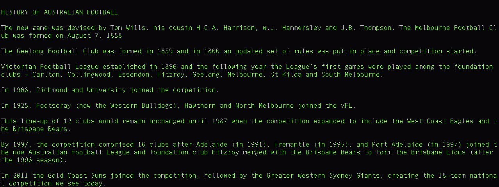

# Software Development Plan

Software development plan states the purpose of the terminal application, providing a list of functions/features that will be implemented in the application.

## Contents

*  Statement of Purpose
*  Included Features
*  User Interaction Guide
*  Error Handling
*  Control Flow Diagram
*  Feature Implementation Plan
*  Test Cases
*  Project Development 
*  Help

## Statement of Purpose

The Terminal applications is called "FOOTYHUB". The users of the application will be able to understand the history of Australian Football League(AFL) and understand the rules and common terms used in the game. Australian Football League is common sports played across australia, with Victoria being the dominant state. It has around 8 teams participating each year from total of 18.

The reason for developing this terminal application is to provide users with simple application to get all the information regarding Australian Footbal League.

Users will be presented with a login screen when the application starts. Once user is verified, the user is presented with home page with different menu options.
Users can choose any option and depending on the selection, will be directed to the corresponding page.
Some of the data is stored in CSV/Text files and it is being retrieved depending on the user input.

Users will be able to check the list of active clubs and depending on the chosen team, can see how many championships they have won till date. Users can also take a quiz which will help them to test their footy knowledge.

This application is mainly intended for users to understand the game of Footy and anyone who likes the game can benefit from this application. The main aim of the application is to keep it simple and make it user friendly, so that anyone can use the application without any difficulties.

## Included Features

The application has various features, which are listed below:

* ***User Login***

This is the first feature of the application and provides users access to use the application.

The login page checks if the username and password is correct. This is done by reading the "Users.csv" file and checking if the username and password is correct.
*user_verification* is the function used to perform user verification. This function takes two arguments - username and password. The function then checks the csv file to complete user verification.
If the user does not exist, there is an option to continue as guest.

Control flow structure redirects users to appropriate sections of the application.
Error handling functionality has been implemented for this feature. When user enters a blank username, it raises an exception that "Username can not be blank". 

* ***Check History of Foooty***

Once the user has successfully logged in, they can choose from severl options which are displayed on a menu.
The first option will help users to know a brief history of the game.

*check_history* is the the function used for this purpose.
When the history option is selected, the function reads data from 'history.txt' file and displays it to the user.

* ***Rules of Foooty***

The second option is 'Rules' which will help users to know some of the rules of the game.

*check_rules* is the the function used for this purpose.
When the 'Rules' option is selected, the function reads data from 'rules.txt' file and displays it to the user.

* ***List of Clubs***

The third option is 'Clubs List' which will display a list of active clubs in footy.

*display_team_list* is the the function used for this purpose.
When the 'Clubs List' option is selected, the function reads data from teams_array, sorts the array alphabetically and displays it to the user.

The function also accepts user input to get users favourite team. Depending on the input(Team), the app displays the championships won by the team. It also represents the data in a pie chart to the user.
This is achieved by reading data from 'championships.csv' file. teams_championships is the function used to achieve this, which takes team_array as an argument.

* ***Take the Quiz***

The fourth option is 'Take the Quiz' which will ask the users to take a quiz to test their footy knowledge.
Users will be presented with five questions and will be provided with final score at the end of the quiz.

*take_quiz* is the the function used for this purpose.

## User Interaction Guide

This section will provide a brief summary for users to know how to use and interact with different features of the application.
(Different commands which can be used to start and interact with this terminal application are listed in the Help section at the bottom of this document.)

### Login Section:
Users will have to input their username and password using keyboard. While the user is typing the password, the password will not be displayed on the screen. It is therefore important, that user enters correct password.
This is for security purposes so that no one else can see users password.

### Choose menu options (After user has logged in):
To choose a particular option from the menu, use the arrow keys(Up and Down) on the keyboard to navigate to the option.
Then press either ENTER or SPACE to select the option.

### Enter favourite team(Clubs List option):
User will need to use keyboard to enter in their favourite team.

### Answering quiz questions(Take the Quiz option):
When taking the quiz, users will have to enter numbers between 1 to 4 using keyboard to submit their answers. As there are only 4 answer options, users need to enter a valid answer which can be any number between 1 and 4.

### Exiting the application
To close the application, navigate to the Exit option using UP/DOWN arrow keys on the keyboard and press ENTER.

## Flowchart

## Feature Implementation Plan

This section provides information regarding how each feature has been implemented and a checklist for each feature.

* Login for the Application

User is prompted to enter a username and password.
A list of users is stored in a csv file called "Users.csv"

Checklist:
1. Check if username is not blank
2. Check if username and password match

* Create Menu

Users have different meunu options to choose from. Each menu option can be selected using up/down arrows on the keyboard and then pressing Enter.

* History and rules

Different functions are called to display History/rules of the game.
Data is read from csv files and displayed to the user

All the features are implemented using different functions and making use of csv files, using loops and various other object oriented concepts in ruby.

# HELP Section

## Before using the Application

Please run the "build.sh" file before using the terminal application.
To run the file, type below command in terminal(Make sure you navigate to the directory which contains build.sh)

bash build.sh

This will create a distribution directory and also copy all the files to distribution directory.
Running "bash.sh" will also install all the required gems on your machine.

Once the above step is completed, please type in below command in the terminal:

**ruby footypedia.rb**

The application can also accept two arguments

1. To go to History page directly, type below command in the terminal:

    **ruby footypedia.rb "history"**

2. To go to Rules page directly, type below command in the terminal:

    **ruby footypedia.rb "rules"**

Github repository for the project
https://github.com/pankajpawar2/Footy-Terminal-App